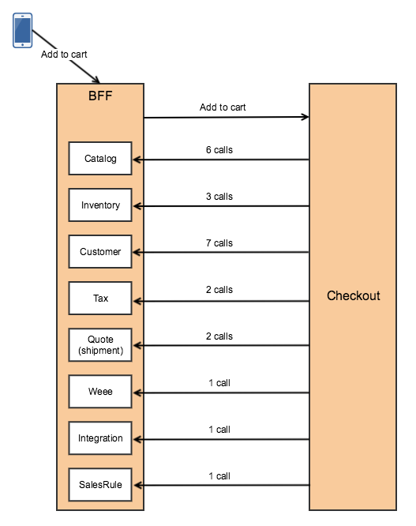
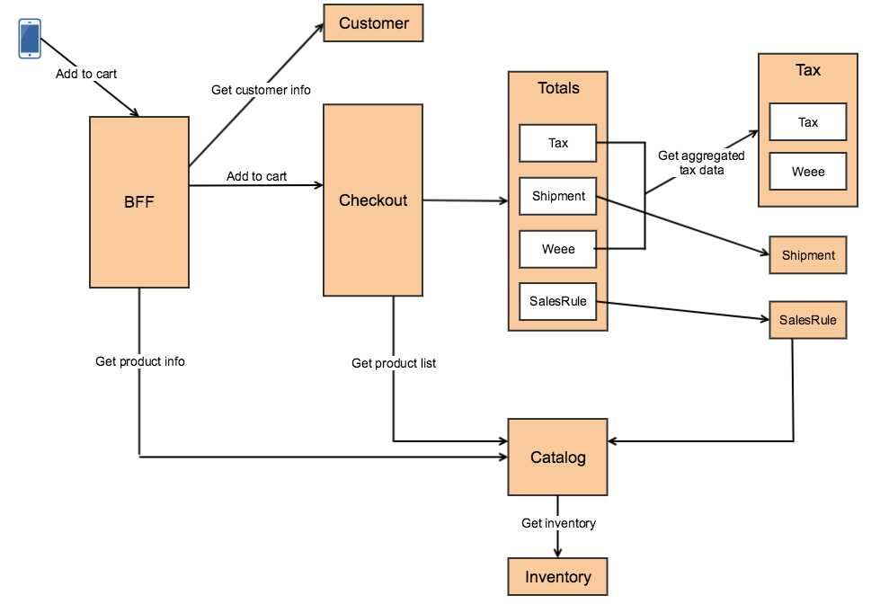

# Checkout Service

## Overview

This document describes checkout service prototype and communication between monolith application and checkout service.

## Communication Between Monolith and Checkout Service

### Add to Cart Operation

Below is the diagram of communication after introducing boundaries between modules and making system do network calls in the places where seams are. System on the diagram makes 23 calls and ~8.5 times slower.

Most likely after introducing boundaries between modules performance of the system will not be optimal and optimizations will have to be done. Some of the possible techniques for reducing number of calls described [here](https://github.com/magento/architecture/blob/6b60580f17be4e015229d9c0f0228d789aa3269c/design-documents/services-decomposition-guidelines.md).

Diagram demonstrates communication between services after the following refactoring and optimizations
* Inventory checks disabled on quote load. Need to be done asynchronous on the shopping cart page and synchronously before placing order
* Customer being passed with customer groups in add to cart operation and shared between multiple service contracts using registry
* Authorization and authentication disabled, need to be implemented as described in [proposal for authentication and authorization](https://github.com/magento/architecture/pull/48)
* Loading of translation configuration is disabled as translation should be part of BFF
* Created new service contracts for
    * \Magento\Quote\Model\Quote\TotalsCollector::collect
    * Magento\Quote\Api\CartRepositoryInterface::save
* Misc changes to avoid unnecessary initialization/queries, for instance \Magento\Catalog\Model\Product::getCustomAttributes
* Missing fields added to interfaces to make hydration/extraction working for all of the fields for the purpose of sending data through the network
* Websites/stores and directory related logic skipped
* \Magento\Catalog\Model\Product\Type\AbstractType::prepareForCartAdvanced skipped, checkout service should receive product will all necessary attributes and prepare for cart logic should be in cart service; catalog service may expose method to get product with all data needed in cart
* New modules introduced SalesProxy, QuoteProxy, QuoteApi, MultishippingProxy, CustomerProxy, CatalogProxy, CheckoutProxy, PaymentProxy, PaypalProxy

System makes 4 calls and ~2 times slower than monolith. After adding caching of get product list request, it would probably be 1.5 slower.

After moving more parts of the system to services, communication may looks something like this.

Cons
* More work for initial iteration as we would have to decouple more services with checkout.

Pros
* Allows reduce calls to BFF
* Allows to avoid intermediate state of the system when calculation totals done in BFF and reduce amount of backwards incompatible changes

## Transactions

Currently Quote module is responsible for creating an order. Need to move this responsibility to order service (BFF after first iteration).

BFF will be responsible for loading quote and managing the transaction. If order placing failed, no additional transactions need to be rolled back after first iteration as all transactions being performed on BFF. If order placing successful, but  removing quote failed, we would need to retry removing quote instead of rolling back. Mechanism of retrying of failed operations is a general concern and should be discussed separately.

## File Uploading

It is possible to allow user upload file for product option of type file. Checkout service should be responsible for storing these files. When user uploads file, BFF should receive the file and send to checkout service. Checkout service then need to receive a file and store it locally or use another service to store the file. When file need to be send to the user, BFF would retrieve file from checkout service via separate API and cache it locally.

There are 3 main options for storing files
* Use clod provided solution
* Mount network file system
* Create separate service for storing files

In the last 2 options would need to create solution for replication and scalability, so the first option might be the easiest and more robust. This question can be explored more in the separate proposal.

## Prototype Limitations

* Add to cart flow with simple product without options, main totals (some totals might be missing or not add up correctly) and guest customer
* Place order scenario is functional (basic flow, critical data captured)
* Some functionality that got broken and looked easy to fix has been left broken
* Checkout service still contains all of the modules

## Backwards Incompatible Changes

* Adding fields to interfaces
* Introducing new service contracts in monolith that going to become a service in the future (possibly can keen backwards compatible by making these service contracts use the new service).
* Adding new fields to service contracts, for instance passing customer in \Magento\Quote\Api\GuestCartItemRepositoryInterface::save. Potentially can keep backwards compatible by leaving monolith use old service contracts and when deployed as distributed setup new ones.
* Most likely we don't want to send all of the data for entity over network. If we go with this approach we will have different sent of fields being passed in ase of monolith and distributed deployment.
* Events potentially
* Some service contracts
    * Currently quote module responsible for saving an order but it should not be. Saving order should be responsibility of the order service (sales modules)
    * \Magento\Bundle\Model\Product\Type::_prepareProduct logic will have to be moved to checkout service for efficiency, potentially can be done in backwards compatible way

## Open Questions

* Instantiation of models for the entities that have EAV attributes leads to database queries. A: Need to refactor models to be DTOs.
* Format of the data API receives is different from the format service contracts use in some cases (for date for instance we expect string via API, but the actual interfaces use array). A: Leave external API for backwards compatibility, introduce new types for services.
* Hydration/extraction for certain entities triggers initialization of resource models/queries to database, ProductInterface is one of the examples. A: These interfaces can't be shared, need to investigate separately.
* A lot of fields are not part of the data interfaces. A: Add fields to the interfaces.
* BFF should not know about numeric quote identifiers.
