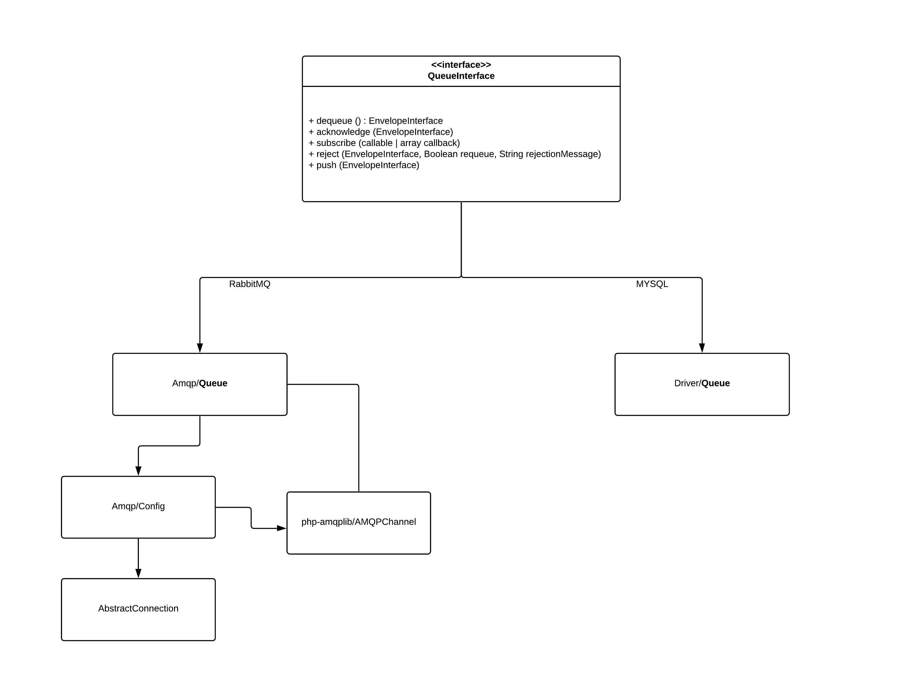
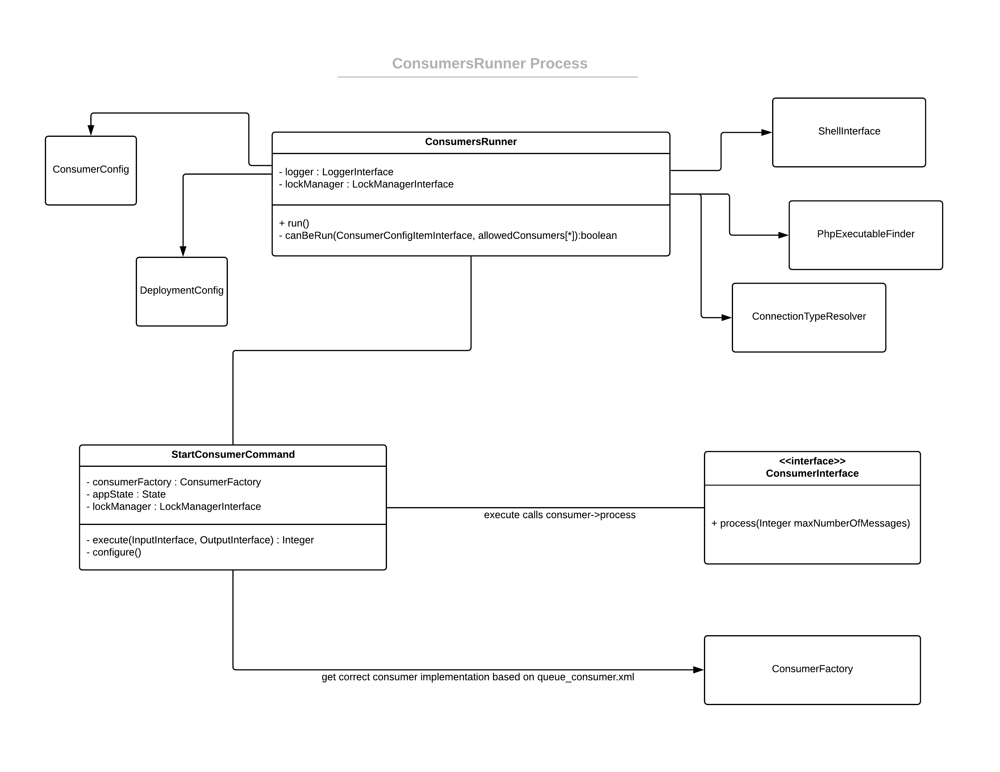
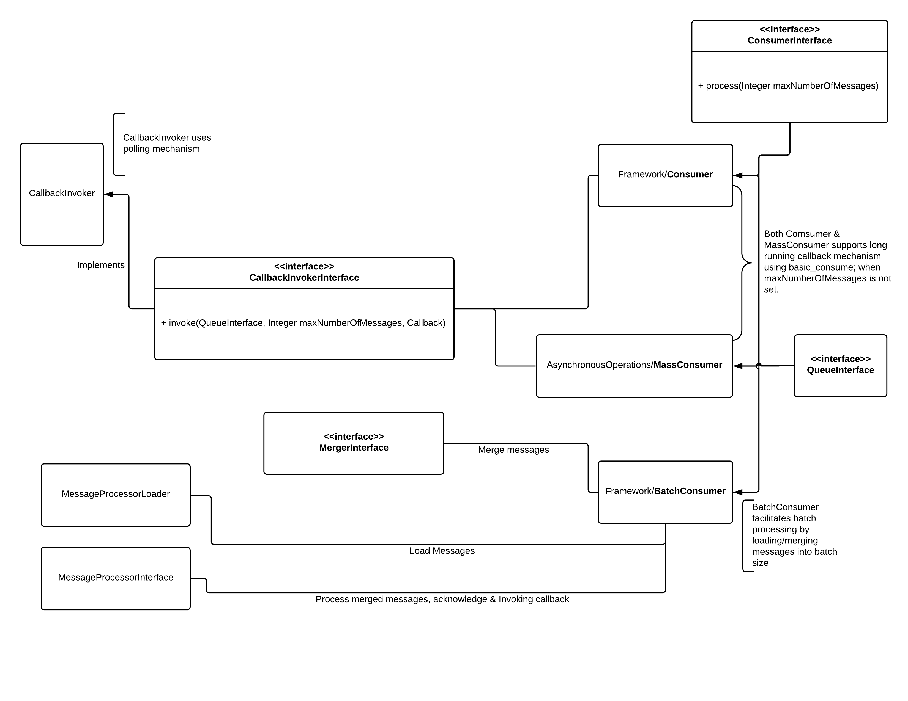

# Messaging Architecture and Options

Magento uses message queue architecture for all asynchronous communication, where message sender and receiver are loosely coupled and doesn't talk to each other directly. For more information go through the following document 

[Magento Message Queue Overview](https://devdocs.magento.com/guides/v2.3/extension-dev-guide/message-queues/message-queues.html)

## Message Queue Processing Design

Currently we have two types of implementations of QueueInterface.

| Implementation | Description                                                  |
| -------------- | ------------------------------------------------------------ |
| MySQL          | This is based on MySQL database, currently it doesn't support the Bulk APIs; this doesn't scale well and designed for out of the box experience; for practical purposes RabbitMQ should be utilized to handle large scale requirements |
| RabbitMQ       | RabbitMQ implementations is based on AMQP protocol, which supports callback mechanism and polling based approach as its supported by underlying channel implementation & specification |

### Consumers Runner Process

ConsumersRunner is the main class, which facilitates the processing of Queued Messages, and based on the configuration in **queue_consumer.xml**, it calls the appropriate ConsumerInterface implementation. 

### Different Types of Consumers

This QueueInterface is been utilized by Consumer classes, there are currently three different implementations of ConsumerInterface

|      | Class Name    | Purpose / Description                                        |
| ---- | ------------- | ------------------------------------------------------------ |
| 1    | Consumer      | This class is for both synchronous and asynchronous style message processing |
| 2    | MassConsumer  | This is mainly designed for asynchronous style message processing; primarily used for Async APIs and Async Bulk APIs |
| 3    | BatchConsumer | This class supports batch processing of messages, helps in picking & merging the messages to a specified batch size, and then process them together, before querying another batch |

##Queue Interface

| #    | Method        | Purpose / Description                                        |
| ---- | ------------- | ------------------------------------------------------------ |
| 1    | dequeue()     | Get a single message from the queue                          |
| 2    | acknowledge() | Acknowledge message delivery                                 |
| 3    | subscribe()   | Wait for messages and dispatch them, this is based on pub/sub mechanism, consumes the messages through callbacks, until connection is closed |
| 4    | reject()      | Reject message, messages gets returned to the queue          |
| 5    | push()        | Push message to queue directly without using exchange; it uses publish behind the scenes |

**Legends**

| Available                | Possiblity                                | Workaround                                                   | Not Possible or N/A                                         |
| :----------------------- | ----------------------------------------- | ------------------------------------------------------------ | ----------------------------------------------------------- |
| Feature is fully support | Feature can be implemented with some work | Feature not directly available, but non-optimal workaround can be implemented | May not be possible due to non-existent platform capability |

