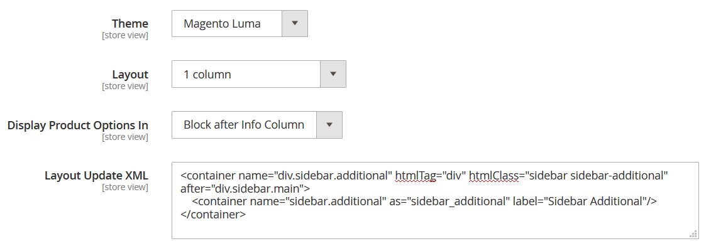
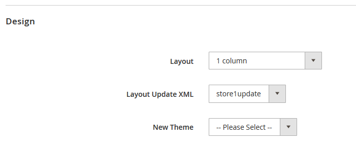

### Move category, product and page specific layout updates
Custom layout updates can be provided for specific categories, products and CMS pages via respective forms in the admin
panel - this is how Merchants can customize entity-specific pages to include additional design and functionality.
 

### The problem
Layout updates are defined using XML and certain instructions often using PHP classes. Only developers can
posses knowledge required to create a layout update yet the only way to provide these updates
is via user forms more commonly used by content managers. That's the __1st problem__ - content managers don't
need that functionality and it is better to hide it from them to avoid them from executing PHP code on the server.
 
__2nd problem__ is that we do not allow developers to work with entity-specific layout updates in a developer way.
Meaning that there is no way to use version control while editing these layout updates.

### Solution
Read custom layout updates from physical files on the server. Convert existing textarea _custom_layout_update_ field
in category/product/cms page form into a _select_ field where existing custom layout update files could be selected.
A developer would create a layout file following this template:
_app/design/custom\_layout/\<category/product/page\>/layout\_update\_\<entity ID\>\_\<readable layout update name\>.xml_.
 
e.g. if a file with the name _app/design/custom\_layout/page/layout\_update\_2\_store1update.xml_ is created then
the select on home page's edit form (home page has ID = 2) will look like this:
 

 
This way merchants will still be able to manage different layouts for different stores or staging updates. In case
of the example above the developer could also create _layout\_update\_2\_store2update.xml_ and
_layout\_update\_2\_june2019update.xml_ to use for another store or for staging.
 
In order to preserve backward compatibility existing layout updates will work but users will not be able to create new ones.
When an entity already had a layout update provided via the text area the select will show _'\*Existing layout update\*'_.
 
This way only developers will be able to change layouts for specific entity pages and be able to use
VCS while creating the layouts.
