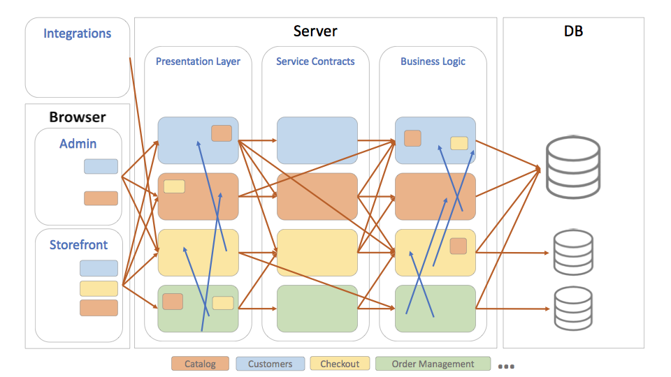
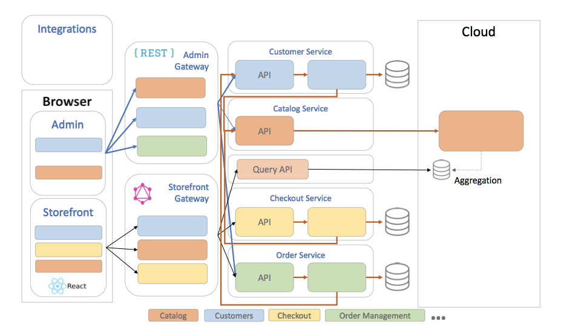

# Magento Service Isolation Vision

## Current state

Magento Commerce was designed as a monolithic modular application: the codebase is split to functional modules, but the modules are deployed together. This has following implications:

* Even though a modular code structure groups related behavior, it is easy to introduce an undesired dependency between application services, because services are not deployed and tested independently. Only static modularity analysis is performed.
* An application has to be deployed as a whole. You cannot deploy updated versions of separate services independently.
* An application has to be scaled as a whole. There is no ability to scale separate services independently.

The introduction of service contracts in Magento 2.0 was the first step towards service isolation:

* Every module defines its API (service contracts), which are PHP interfaces that can be called either from within a PHP process or remotely through REST, SOAP or AMQP APIs.
* Every module can call other modules only through their service contracts.

In later releases, we introduced more service contracts, and more modules were switched to service contract communication. However, legacy undesired dependencies (direct inter-module model-to-model and presentation-to-model dependencies) still exist. This fact does not allow true module separation. Most of the undesired inter-module dependencies reside in the UI (presentation-to-model).

On the data level, we introduced the ability to split checkout and order management databases. This improved the scalability of Magento instances.

## Desired state

The application consists of technically independent, separately and\or jointly deployable\scalable\replaceable\maintainable parts - services.  

Benefits:

* Easier to comprehend services with less dependencies
* Easier for System Integrators to replace Magento built-in services with third-party systems when such need occurs
* Services can be scaled independently on Magento instances
* Teams have clear ownership boundaries
* Granular releases - services can be released independently
* In isolated services it is easier to use data storage with more appropriate storage models.
* Easier to experiment and replace services

### Application decomposition to Services

A service implements distinct business behavior.
A service consists of one or several modules.

Communication among services rely on service contracts only.
Services deployed jointly within one Magento instance use service contracts as calls within a PHP process.
Services deployed separately within dedicated Magento instances use service contracts as remote calls through REST, SOAP or AMQP APIs.

The requirement to communicate through service contracts applies to communication among services only.
Modules within one service may use direct communication and extendability. 

### Entry Point Services

Client specific logic (PWA, point of sale, mobile app, etc) is separated from business logic and located in special endpoint services - BFFs.
A dedicated BFF should created for each application client.

The following BFFs may be created:

* Storefront server-side content generation 
  * Existing UI
  * Will be deprecated later
* Storefront PWA launcher
  * Launch a PWA Application shell with page data (product information, category information)
  * Routing to storefront scenarios only
* Storefront GraphQL endpoint
  * Serve GraphQL requests of a PWA application
  * Potentially may be merged with Storefront PWA launcher
* Admin server-side content generation
  * Used by admin app and integrations
  * Mostly CRUD operations for entities
  * Token based authentication
  * ACL-based authorization
  * REST

### Business Logic Services

Functionality responsible for business logic is located in Domain services.
Each selffsuficient business process is located within a separate Domain service.

Existing modules related with the same business logic may be associated with specific Domain services:
   
- Catalog
    - Magento/Catalog
    - Magento/CatalogGraphql
    - Magento/ConfigurableProduct
    - Magento/Downloadable
    - Magento/BundleProduct
    - ...
- Checkout
    - Magento/Checkout
    - Magento/Quote
    - Magento/Multishipping
    - Magento/CheckoutAgreements
    - ...

The following application services are currently identified to be isolated (green - Magento Open Source, yellow - Magento Commerce, red - Magento B2B):

 

## Design principles

### Platform 
The platform and main APIs must stay the same (PHP, Magento Framework).

### Cloud-native

The Magento application follows the principles of [12-factor application](https://12factor.net/). 

### General

* Current service contracts SHOULD BE preserved for backward compatibility
* All new service contracts MUST follow design principles described in technical guidelines + following principles:
* All operations MUST BE idempotent. Network communication is unreliable. Retries will be required, and some messages will be delivered more than once.
* Sagas SHOULD BE used for consistency of distributed operations
* All new service contracts SHOULD expose asynchronous APIs
* All new state modifying operations SHOULD expose bulk APIs
* All Domain service operations MUST BE stateless
* There MUST BE NO data dependencies between services.
* Command & query responsibility segregation – storefront APIs for data immutable in storefront (catalog) should be optimized for data retrieval
* Domain services MUST NOT manage session, this is responsibility of BFF. APIs of the services have to explicitly declare all required arguments.

## Additional Requirements 

### Ecosystem

The current data model of Marketplace does not support multiple packages per extension. Since an extension can customize multiple services, it should be possible to create an extension that consists of multiple composer packages. Such extensions must be supported by Magento Marketplace.
Example: MyVendorShippingMethod extension modifies shipment and checkout services. MyVendorShippingMethod extension consists of 2 composer packages in Marketplace: MyVendorShipment and MyVendorCheckout.

### Development and Integration 

Magento testing builds should run Magento both as a monolithic application and as a set of independent services.
A special Development environment created to support mentioned changes. 

### Operations

The distributed deployment approach requires improved tooling to make it easy to deploy, monitor, and troubleshoot the Magento application. 
Magento services must support centralized application configuration management.
Schema migration tooling should be provided.

## Links

* [Implementation](service-isolation/implementation.md)
* [Roadmap | Backlog | Delivery](https://github.com/magento/service-isolation-backlog-wiki)

